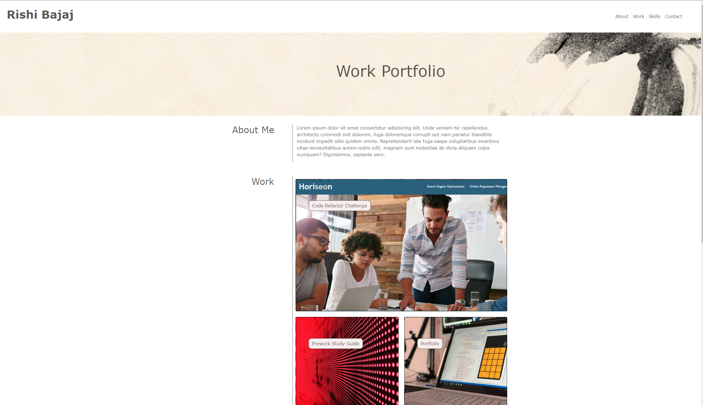

# Bootstrap-Portfolio

## Description
Portfolio of work, created using Bootstrap, including the follwing sections:
    - navigation bar with links to other sections further down the page
    - hero section with profile picture, name and link to further info
    - main section split into About Me, Work and Skills
    - footer with details about how to get in touch

## Usage

The site can be used to showcase the projects I have worked on to potential employers. In particular the 'Work' section has five cards displayed in a grid, which can link to completed projects. Using bootcamp templates has reduced the number of media queries needed to make the page device responsive.

Here is a screenshot of the deployed application:

## License

MIT